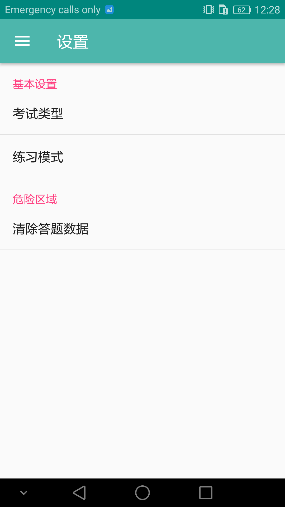

# 业余无线电台操作证考试练习程序

[点击下载APK程序](https://github.com/wanxio/Aroce/releases/download/v1.2.0/Aroce.apk)

## 题目来源

程序中所有的题目(包括题目文本,选项以及图片)来自:
[业余无线电台操作证书考试题库（电子版文本）下载](http://www.ragd.org/gdwxdportal/ArticleDetail.aspx?ColID=48ffc50aa41a489889fc25153c9434ec&Id=d5c213bfd82f4e4e8975ed7bf596253b)

## 程序运行图片

  
